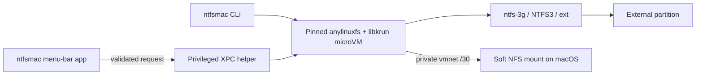

# ntfsmac by BinaryBears


Native Apple Silicon NTFS read/write for macOS, without kernel extensions or disabling SIP.

> [!NOTE]
> BinaryBears `v3.0.0` is the current published release. Download the signed Apple Silicon DMG
> from [GitHub Releases](https://github.com/BinaryBearsLLC/ntfsmac/releases/latest).

ntfsmac runs the filesystem driver inside a small Linux microVM and exposes the mounted volume to
macOS over a private NFS link. `ntfs-3g` is the compatibility-first default; NTFS3 is an explicit
experimental choice.

## Highlights

- Native SwiftUI menu-bar app named **ntfsmac**.
- Read/write NTFS on Apple Silicon, plus ext2/ext3/ext4 support.
- No kernel extension, Reduced Security mode, or SIP changes.
- Privileged operations isolated behind a reviewed XPC helper.
- Private `/30` vmnet transport with measured PF and route state.
- Verified Copy and Verify commands with flush, reread, and SHA-256 manifests.
- Privacy-safe diagnostics that are never uploaded automatically.
- Optional release check that only opens the matching GitHub Release.

## Requirements

- Apple Silicon Mac.
- macOS 13 Ventura or newer.
- An external partition in a supported filesystem.
- Administrator approval for the privileged helper and Full Disk Access for that helper.

Intel Macs are not supported.

## Install

### Official BinaryBears release

1. Download `ntfsmac-3.0.0-Apple-Silicon.dmg` from
   [GitHub Releases](https://github.com/BinaryBearsLLC/ntfsmac/releases/latest).
2. Open the DMG and drag `ntfsmac.app` to Applications.
3. Launch **ntfsmac** and approve the guided helper setup.
4. In Full Disk Access, enable the entry identified in the app's instructions.

Official BinaryBears DMGs are Developer ID signed, notarized by Apple, stapled, and published with
a SHA-256 checksum. Draft releases are not final downloads.

### Build from source

```sh
git clone --branch dev --recurse-submodules https://github.com/BinaryBearsLLC/ntfsmac.git
cd ntfsmac
./build.command
```

GUI builds automatically create the standard `ntfsmac-X.Y.Z-Apple-Silicon.dmg` and the
`ntfsmac-X.Y.Z-Legacy-Apple-Silicon.dmg` compatibility alternative. The standard product never
uses the internal P2 project name. Pass `--no-legacy` after `gui` or `both` only when the Legacy
artifact is deliberately not needed. Local builds use ad-hoc signing by default and require no
Apple credentials. See
[CONTRIBUTING.md](CONTRIBUTING.md) for the development workflow.

## Use

Open `ntfsmac.app`, select a detected drive, and choose **Mount**. The normal Mount action always
uses `ntfs-3g`. The adjacent menu offers **NTFS3 (Experimental)** for controlled testing after
Windows Fast Startup, dirty-volume, and `chkdsk` guidance.

The CLI remains available for scripted and diagnostic use:

```sh
ntfsmac list
ntfsmac mount disk4s1
ntfsmac mount --fs-driver ntfs3 disk4s1
ntfsmac unmount disk4s1
ntfsmac diagnose
```

Only partition identifiers matching `diskNsN` are accepted. A whole disk such as `disk4` is
rejected independently by the CLI and helper.

### Verified Copy

```sh
ntfsmac copy --verify /path/to/source /Volumes/DRIVE/destination
ntfsmac verify /path/to/source /Volumes/DRIVE/destination
```

Verified Copy writes to a recoverable partial destination, flushes it, rereads it, and publishes
the final name only after the deterministic SHA-256 manifest matches. The result proves the bytes
read at that time; it cannot guarantee against later media failure.

### Diagnostics

- Click **Diagnose** for a plain-language summary.
- Command-click **Diagnose** to export the privacy-safe JSON report.
- Review the report before attaching it to an issue. ntfsmac never uploads it automatically.

Reports omit usernames, volume labels, device identifiers, serial numbers, mount paths, IP
addresses, DNS servers, route tables, and VPN provider details.

## How it works



Mount, unmount, PF, and route operations initiated by the app always go through the helper; the UI
never shells out to `sudo`. NFS remains `soft` to avoid an indefinitely blocked macOS filesystem
call after hot-unplug or guest failure.

## Security and updates

The three SECURITY rows use measured, reason-coded state and fail closed to `unknown` when evidence
is missing. See [SECURITY.md](SECURITY.md) for the reporting boundary.

The optional update check contacts only GitHub's public latest-release endpoint, at most once every
24 hours. It never downloads or installs anything: if a newer stable SemVer release exists, the app
offers to open that release in the browser. Automatic network failures remain silent.

## Project status

The current fork baseline completed its measured P0/P1 acceptance ledger with no remaining measured
failure. Two resource-dependent extended cells remain explicitly blocked, not silently counted as
passes. `v3.0.0` was published on 2026-08-18 after the downloaded GitHub DMG passed checksum,
Gatekeeper, install, mount, write/reread, and unmount validation. It remains the current supported
release. The source tree contains the `v3.1.0` dual-distribution candidate, but that candidate is
not a published release until both artifacts complete their local and downloaded-DMG acceptance
gates.

- [Roadmap](docs/BINARYBEARS_ROADMAP.md)
- [Validation ledger](docs/testing/BINARYBEARS_VALIDATION_RESULTS_2026-08-12.md)
- [Branch policy](docs/BRANCHING.md)
- [Release process](docs/RELEASE.md)

## Contributing

Focused bug fixes and improvements are welcome. Read [CONTRIBUTING.md](CONTRIBUTING.md), open an
issue when useful, and target BinaryBears work to `dev`. No CLA is required.

## Credits

ntfsmac was created by [Kaveen (khr898)](https://github.com/khr898), who remains the original
author and upstream maintainer. The original repository is
[`khr898/ntfsmac`](https://github.com/khr898/ntfsmac). BinaryBears maintains this fork and its
additional product, reliability, diagnostics, and release work.

The runtime builds on [`nohajc/anylinuxfs`](https://github.com/nohajc/anylinuxfs) and the upstream
components listed in [THIRD_PARTY_LICENSES.md](THIRD_PARTY_LICENSES.md).

## License

MIT. The original copyright and license notice are preserved in [LICENSE](LICENSE).
