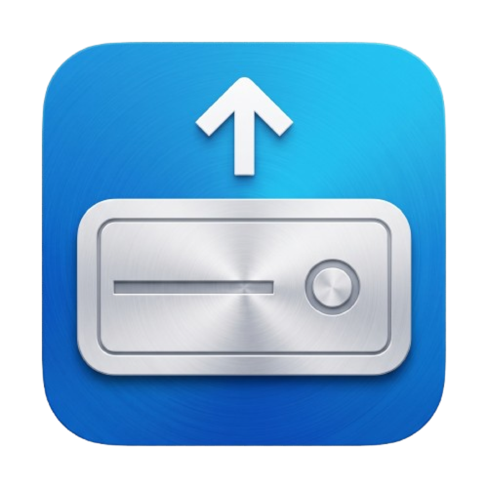
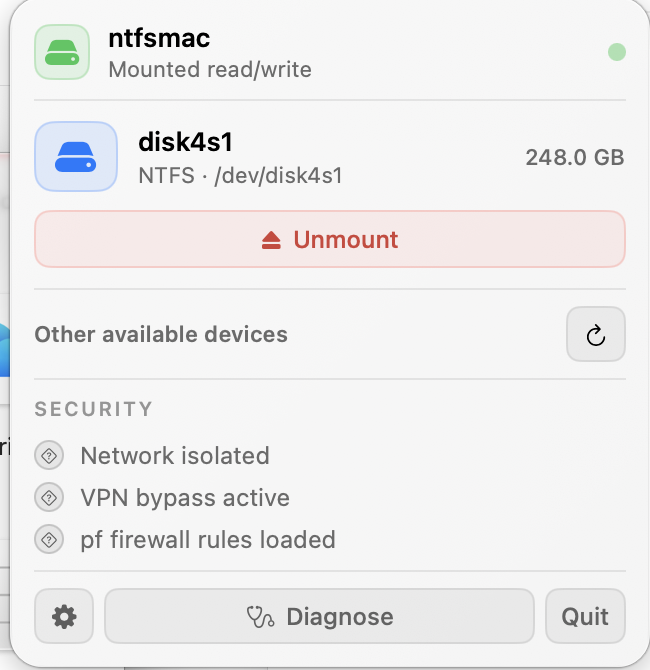
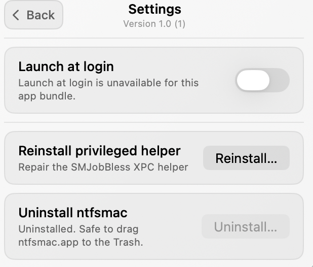
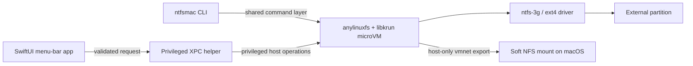

<div align="center">
  
  <h1>ntfsmac — BinaryBears Edition</h1>
  <p><strong>Read and write NTFS, ext2, ext3, and ext4 volumes on Apple Silicon macOS.</strong></p>
  <p>A native menu-bar app and CLI powered by an isolated Linux microVM — no kernel extension and no SIP changes.</p>

  <p>
    <a href="https://github.com/BinaryBearsLLC/ntfsmac/actions/workflows/ci.yml"></a>
    
    
    
    <a href="LICENSE"></a>
  </p>

  <p>
    <a href="#why-ntfsmac">Why ntfsmac</a> ·
    <a href="#binarybears-improvements">Fork improvements</a> ·
    <a href="#screenshots">Screenshots</a> ·
    <a href="#quick-start">Quick start</a> ·
    <a href="#architecture">Architecture</a> ·
    <a href="#roadmap">Roadmap</a>
  </p>
</div>

> [!IMPORTANT]
> This README documents the [`BinaryBearsLLC/ntfsmac`](https://github.com/BinaryBearsLLC/ntfsmac) fork and its `main` branch. ntfsmac was created by [khr898](https://github.com/khr898), who remains the original author and upstream maintainer. The original project is available at [`khr898/ntfsmac`](https://github.com/khr898/ntfsmac). BinaryBears-specific additions are identified below; all original-project credit is preserved.

## Why ntfsmac

macOS can read NTFS volumes but does not provide native NTFS write support. ntfsmac takes a virtualization-first approach: [`anylinuxfs`](https://github.com/nohajc/anylinuxfs) runs `ntfs-3g` inside a lightweight `libkrun` Linux microVM, then exposes the filesystem to macOS through NFS over a host-only `vmnet` bridge.

The same isolated path supports ext2, ext3, and ext4. The guest kernel handles those filesystems using its built-in ext4 driver, with the actual type detected by `blkid`.

- No kernel extension
- No SIP modification
- No proprietary filesystem driver
- No raw `sudo` command launched by the GUI
- One shared mount engine for the menu-bar app and CLI

### Requirements

| Requirement | Support |
| --- | --- |
| Mac | Apple Silicon (`arm64`) only |
| macOS | 13.0 Ventura or newer |
| Filesystems | NTFS, ext2, ext3, ext4 |
| Distribution | Ad-hoc signed; not notarized |

## BinaryBears improvements

The BinaryBears fork builds on the original project with a more complete, verifiable desktop experience and stronger operational diagnostics.

| Area | Improvements over the initial base version |
| --- | --- |
| UI and UX | Settings live inside the menu-bar popover; the icon adapts correctly to the menu bar; contextual tooltips clarify actions; Diagnose has an inline **Hide** action; the app prevents duplicate instances; version and build appear directly in Settings. |
| Drive handling | NTFS detection also recognizes MBR `Windows_NTFS` volumes; ext2/3/4 are supported through the shared mount path; multiple drives can be mounted concurrently with per-drive status. |
| Diagnostics | Text and JSON reports use the same canonical fields; **Command-click Diagnose** opens a save panel for a developer-oriented JSON report; output includes app/build, OS, architecture, helper state, runtime health, a privacy-safe VPN boolean, and active NFS mount count. |
| Helper lifecycle | Friendlier Full Disk Access guidance; a lazy XPC connection avoids stale startup state; helper reinstall and confirmed uninstall stay inside the popover and report success or actionable failure. |
| Build and release | The interactive [`build.command`](build.command) verifies prerequisites, builds CLI and/or GUI, runs relevant tests, packages artifacts under `dist/`, and validates bundle structure, architecture, and ad-hoc signatures. |
| Security honesty | SECURITY indicators never manufacture a green success state. Until live evidence is wired, the UI displays **unknown** rather than claiming a protection is active. |

## Screenshots

<div align="center">
  <table>
    <tr>
      <td align="center" valign="top">
        
      </td>
      <td align="center" valign="top">
        
      </td>
    </tr>
    <tr>
      <td align="center"><sub>Mounted drive, available devices, and conservative SECURITY status.</sub></td>
      <td align="center"><sub>In-popover Settings with canonical app version and helper controls.</sub></td>
    </tr>
  </table>
</div>

> [!NOTE]
> The question marks in the mounted-drive screenshot are intentional. The current build does not yet collect live evidence for those three SECURITY rows, so it reports `unknown` instead of showing a misleading checkmark. Evidence-backed checks are part of the [roadmap](#roadmap).

## Quick start

### Build the BinaryBears fork

Clone this fork and use its guided builder:

```sh
git clone https://github.com/BinaryBearsLLC/ntfsmac.git
cd ntfsmac
./build.command
```

Choose **CLI**, **GUI**, or **both** when prompted. You can also select a target directly:

```sh
./build.command cli
./build.command gui
./build.command both
```

The builder explains missing prerequisites before changing anything, asks before installing supported dependencies, runs the applicable checks, and writes verified artifacts to `dist/`. It does not install the CLI into `/usr/local` automatically.

### Original upstream distribution

The original project maintains its own Homebrew tap and release channel. These commands install the upstream build, not the BinaryBears fork:

```sh
brew tap khr898/ntfsmac
brew install ntfsmac
ntfsmac diagnose
```

Visit the [upstream releases](https://github.com/khr898/ntfsmac/releases) for upstream GUI artifacts.

## Usage

```sh
ntfsmac mount <disk identifier>       # for example: disk4s1
ntfsmac unmount <disk identifier>
ntfsmac diagnose                      # human-readable, read-only report
ntfsmac diagnose --json               # privacy-safe structured report
ntfsmac uninstall                     # remove CLI/runtime/helper components
ntfsmac help
```

ntfsmac accepts partitions in `diskNsN` form, never a whole disk such as `disk4`. Device identifiers are independently validated in the CLI and privileged helper against `^disk[0-9]+s[0-9]+$` before they reach a shell command.

### Developer diagnostics from the GUI

- Click **Diagnose** for an inline, plain-language health summary.
- Hold **Command (⌘)** while clicking **Diagnose** to run the same read-only JSON diagnosis and choose where to save it.
- Review the file, then attach it manually to a bug report if appropriate. ntfsmac never uploads it.

Reports intentionally omit usernames, serial numbers, volume labels, device identifiers, mount paths, IP addresses, DNS servers, route tables, and VPN provider or interface names. See [SECURITY.md](SECURITY.md) for the reporting policy.

## Architecture



Mount, unmount, packet-filter, and route operations initiated by the GUI go through the XPC helper; the app does not shell out to `sudo`. The NFS client uses a soft mount so a failed guest cannot block filesystem calls indefinitely. For the full design and invariants, read [docs/dev/PLAN.md](docs/dev/PLAN.md).

## Security model

- Partition identifiers are allow-listed before shell invocation.
- The Linux guest is reached through a host-only `vmnet` bridge.
- Privileged GUI operations are restricted to the helper's XPC protocol.
- Dependency versions and source hashes are pinned and verified by the build system.
- SECURITY indicators use an explicit `unknown` state and never equate missing data with enforcement.

The project is currently ad-hoc signed (`codesign -s -`) and is not notarized. macOS may therefore require the user to approve the app and its helper. Review [SECURITY.md](SECURITY.md) before installation or vulnerability reporting.

## Troubleshooting

### A drive does not appear

ntfsmac mounts partitions, not whole disks. In `diskutil list`, the external device must contain at least one child identifier such as `disk4s1`. A filesystem written directly to a raw whole disk has no mountable `diskNsN` slice and must be backed up and repartitioned on a suitable system before ntfsmac can enumerate it.

### The first mount takes longer

On first use, the pinned Linux environment is downloaded and initialized (typically about 50–150 MB). This needs an internet connection once; later mounts reuse the local environment.

### Diagnose before filing a bug

```sh
ntfsmac diagnose
ntfsmac diagnose --json
```

Include the privacy-safe JSON report, macOS version, Mac model, and a reproducible description. Do not publish security vulnerabilities; follow [SECURITY.md](SECURITY.md).

## Roadmap

The following improvements are planned for the BinaryBears fork and are **not shipped yet**:

1. **Modern privileged-helper lifecycle** — evaluate and implement a dedicated migration from deprecated `SMJobBless`/`SMJobCopyDictionary` APIs to `SMAppService`, including registration status, approval, upgrade, and uninstall behavior. The migration must preserve the current security boundary and pass clean-Mac installation tests with the project's ad-hoc signing model before it can replace the existing path.
2. **Evidence-backed SECURITY telemetry** — derive host-only isolation, VPN route/bypass behavior, and packet-filter rule state from read-only runtime evidence. A green/enforced state must appear only when the corresponding condition has actually been measured.
3. **Hide the SECURITY panel** — add a non-destructive **Hide** action, consistent with Diagnose, while preserving mount state and making the panel easy to reveal again.
4. **Security-state test matrix** — validate mounted and unmounted drives, VPN on and off, unavailable tooling, stale state, malformed output, and helper reconnection so the UI never falls back to hardcoded claims.

Roadmap work will be developed and reviewed in focused branches and pull requests.

## Contributing

Contributions are welcome. Start with [CONTRIBUTING.md](CONTRIBUTING.md), then read [CLAUDE.md](CLAUDE.md) (mirrored for tooling through [AGENTS.md](AGENTS.md)) before changing architecture, dependencies, signing, or the privileged boundary.

## Credits

- **Original creator and upstream maintainer:** [khr898](https://github.com/khr898)
- **Original repository:** [`khr898/ntfsmac`](https://github.com/khr898/ntfsmac)
- **BinaryBears fork and additional UI/UX/CLI work:** [`BinaryBearsLLC/ntfsmac`](https://github.com/BinaryBearsLLC/ntfsmac)
- **Core filesystem runtime:** [`nohajc/anylinuxfs`](https://github.com/nohajc/anylinuxfs) and its upstream dependencies

## License

Released under the [MIT License](LICENSE). Copyright and attribution remain with their respective authors and contributors.
