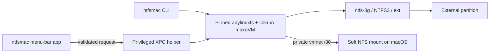

# ntfsmac by BinaryBears


Native Apple Silicon NTFS read/write for macOS, without kernel extensions or disabling SIP.

> [!NOTE]
> Download the latest signed Apple Silicon DMG from
> [GitHub Releases](https://github.com/BinaryBearsLLC/ntfsmac/releases/latest).

ntfsmac runs the filesystem driver inside a small Linux microVM and exposes the mounted volume to
macOS over a private NFS link. `ntfs-3g` is the compatibility-first default; NTFS3 is an explicit
experimental choice.

## Highlights

- Native SwiftUI menu-bar app named **ntfsmac**.
- Read/write NTFS on Apple Silicon, plus ext2/ext3/ext4 support.
- No kernel extension, Reduced Security mode, or SIP changes.
- Privileged operations isolated behind a reviewed XPC helper.
- Private `/30` vmnet transport with measured PF and route state.
- Verified Copy and Verify commands with flush, reread, and SHA-256 manifests.
- Privacy-safe diagnostics that are never uploaded automatically.
- Optional release check that only opens the matching GitHub Release.

## Requirements

- Apple Silicon Mac.
- macOS 13 Ventura or newer.
- An external partition in a supported filesystem.
- Administrator approval for the privileged helper and Full Disk Access for that helper.

Intel Macs are not supported.

## Install

### Official BinaryBears release

1. Download the standard `ntfsmac-X.Y.Z-Apple-Silicon.dmg` from
   [GitHub Releases](https://github.com/BinaryBearsLLC/ntfsmac/releases/latest).
2. Open the DMG and drag `ntfsmac.app` to Applications.
3. Launch **ntfsmac** and approve the guided helper setup.
4. Connect a supported drive and, when prompted, enable the Full Disk Access entry identified by
   the app.

With no supported drive connected, ntfsmac shows **No drives found**. It verifies Full Disk Access
when a supported partition is detected.

Official BinaryBears DMGs are Developer ID signed, notarized by Apple, stapled, and published with
a SHA-256 checksum. Draft releases are not final downloads.

### Build from source

```sh
git clone --branch dev --recurse-submodules https://github.com/BinaryBearsLLC/ntfsmac.git
cd ntfsmac
./build.command
```

GUI builds automatically create the standard `ntfsmac-X.Y.Z-Apple-Silicon.dmg` and the
`ntfsmac-X.Y.Z-Legacy-Apple-Silicon.dmg` compatibility alternative. Pass `--no-legacy` after
`gui` or `both` only when the Legacy artifact is deliberately not needed. When the exact
BinaryBears Developer ID Application identity is installed, the builder selects it automatically
and produces a locally installable standard helper; otherwise it clearly marks the result as an
ad-hoc UI/structure build whose helper macOS cannot register. `SIGNING_IDENTITY=-` deliberately
forces that credential-free fallback. See
[CONTRIBUTING.md](CONTRIBUTING.md) for the development workflow.

## Use

Open `ntfsmac.app`, select a detected drive, and choose **Mount**. The normal Mount action always
uses `ntfs-3g`. The adjacent menu offers **NTFS3 (Experimental)** for controlled testing after
Windows Fast Startup, dirty-volume, and `chkdsk` guidance. Once mounted, **Open in Finder** opens
the network-backed volume; Finder provides normal file browsing and writing when the mount is
confirmed read/write.

The CLI remains available for scripted and diagnostic use:

```sh
ntfsmac list
ntfsmac mount disk4s1
ntfsmac mount --fs-driver ntfs3 disk4s1
ntfsmac unmount disk4s1
ntfsmac diagnose
```

Only partition identifiers matching `diskNsN` are accepted. A whole disk such as `disk4` is
rejected independently by the CLI and helper.

### Verified Copy

```sh
ntfsmac copy --verify /path/to/source /Volumes/DRIVE/destination
ntfsmac verify /path/to/source /Volumes/DRIVE/destination
```

Verified Copy writes to a recoverable partial destination, flushes it, rereads it, and publishes
the final name only after the deterministic SHA-256 manifest matches. The result proves the bytes
read at that time; it cannot guarantee against later media failure.

### Diagnostics

- Click **Diagnose** for a plain-language summary.
- Command-click **Diagnose** to export the privacy-safe JSON report.
- Review the report before attaching it to an issue. ntfsmac never uploads it automatically.

Reports omit usernames, volume labels, device identifiers, serial numbers, mount paths, IP
addresses, DNS servers, route tables, and VPN provider details.

### Current behavior

- Diagnose presents four plain-language categories; technical evidence remains available through
  the CLI and Command-click JSON export. A mount-state change invalidates the visible result and
  refreshes it automatically while the panel is open.
- An unexpected read-only mount is attributed to Windows only when the backend provides matching
  evidence. ntfsmac never offers a forced read/write override for an unsafe volume.
- Quit protects mounted drives with **Unmount and Quit**, **Quit Anyway**, and **Cancel**. Only the
  safe unmount action can be remembered.
- Standard and Legacy builds share the same reviewed mount/runtime path. The standard helper is
  verified before any working Legacy helper is removed.
- Drive-runtime failures have their own retry state and are never presented as Full Disk Access or
  “no drive connected”.
- Both DMGs use the approved BinaryBears artwork and preserve the visible app name **ntfsmac**.

## How it works



Mount, unmount, PF, and route operations initiated by the app always go through the helper; the UI
never shells out to `sudo`. NFS remains `soft` to avoid an indefinitely blocked macOS filesystem
call after hot-unplug or guest failure.

## Security and updates

ntfsmac summarizes measured protection evidence inside Diagnose and fails closed to an
explicit unavailable/attention state when evidence is missing. The CLI retains its reason-coded
detail. See [SECURITY.md](SECURITY.md) for the reporting boundary.

The optional update check contacts only GitHub's public latest-release endpoint, at most once every
24 hours. It never downloads or installs anything: if a newer stable SemVer release exists, the app
offers to open that release in the browser. Automatic network failures remain silent.

## Project status

`v3.1.0` introduced the standard SMAppService build while retaining a labelled Legacy DMG.
`v3.1.1` isolated one optional container-registry metadata path; follow-up hardening for the full
OCI configuration and first runtime check is in development. [GitHub Releases](https://github.com/BinaryBearsLLC/ntfsmac/releases/latest)
is the authoritative source for signed and notarized builds.

- [Roadmap](docs/BINARYBEARS_ROADMAP.md)
- [Validation ledger](docs/testing/BINARYBEARS_VALIDATION_RESULTS_2026-08-12.md)
- [Branch policy](docs/BRANCHING.md)
- [Release process](docs/RELEASE.md)

## Contributing

Focused bug fixes and improvements are welcome. Read [CONTRIBUTING.md](CONTRIBUTING.md), open an
issue when useful, and target BinaryBears work to `dev`. No CLA is required.

## Credits

ntfsmac was created by [Kaveen (khr898)](https://github.com/khr898), who remains the original
author and upstream maintainer. The original repository is
[`khr898/ntfsmac`](https://github.com/khr898/ntfsmac). BinaryBears maintains this fork and its
additional product, reliability, diagnostics, and release work.

The runtime builds on [`nohajc/anylinuxfs`](https://github.com/nohajc/anylinuxfs) and the upstream
components listed in [THIRD_PARTY_LICENSES.md](THIRD_PARTY_LICENSES.md).

## License

MIT. The original copyright and license notice are preserved in [LICENSE](LICENSE).
