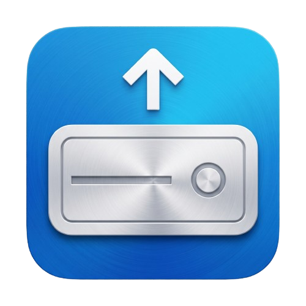
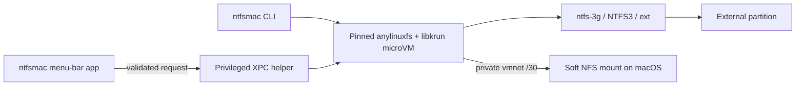

# ntfsmac by BinaryBears



Native Apple Silicon NTFS read/write for macOS, without kernel extensions or disabling SIP.

> [!NOTE]
> Download the latest signed Apple Silicon DMG from
> [GitHub Releases](https://github.com/BinaryBearsLLC/ntfsmac/releases/latest).

ntfsmac runs the filesystem driver inside a small Linux microVM and exposes the mounted volume to
macOS over a private NFS link. `ntfs-3g` is the compatibility-first default; NTFS3 is an explicit
experimental choice.

## Highlights

- Native SwiftUI menu-bar app named **ntfsmac**.
- Read/write NTFS on Apple Silicon, plus ext2/ext3/ext4 support.
- No kernel extension, Reduced Security mode, or SIP changes.
- Privileged operations isolated behind a reviewed XPC helper.
- Private `/30` vmnet transport with measured PF and route state.
- Verified Copy and Verify commands with flush, reread, and SHA-256 manifests.
- Privacy-safe diagnostics that are never uploaded automatically.
- Optional release check that only opens the matching GitHub Release.

## Requirements

This branch prepares **3.1.3 Beta 3**. The currently published beta remains Beta 2,
separate from the stable 3.1.2 line.
The beta targets macOS 14+; native Sonoma filesystem qualification remains open.
The compatibility table below distinguishes verified operations from the build target.

- Apple Silicon Mac.
- macOS 14 Sonoma or newer (3.1.3 build target).
- An external partition in a supported filesystem.
- Administrator approval for the privileged helper and Full Disk Access for that helper.

Intel Macs are not supported.

### Compatibility evidence for 3.1.3

The minimum build target is not a claim that every Mac or macOS release has been tested.

| System | Confirmed locally | Still unverified |
| --- | --- | --- |
| macOS 26.6.2, Apple M5 (physical Mac) | Official notarized Beta 2 (31304): app/helper update; NTFS, ext2, ext3 and ext4 write/flush/remount/SHA-256 checks; simultaneous NTFS/EXT detection. NTFS/ExFAT detection previously checked on 31302 | Other M-series models and longer-term workloads |
| macOS 14.6.1 Sonoma (local VM on M5) | Official notarized Beta 2 (31304): Gatekeeper, app/helper update, Settings/error-view rendering and diagnostics; earlier helper installation recovery documented separately | This VM lacks nested Hypervisor access for filesystem mounting/read/write |
| Other macOS 14.x, macOS 15, other macOS 26 versions and newer | Deployment target and guarded API paths only | Native end-to-end testing |

Intel and macOS 13 or earlier are outside the 3.1.3 target. The preserved 3.1.2 line
declared macOS 13+ on Apple Silicon; that declaration is not retrospective proof of testing
on every supported OS. Legacy distribution is deprecated in 3.1.3.

**Help confirm compatibility.** If you test 3.1.3 on a native Apple Silicon Mac, please
[submit a compatibility report](https://github.com/BinaryBearsLLC/ntfsmac/issues/new/choose)
with the app version/build, macOS version, chip family, filesystem and the operations you
completed (mount, copy, eject and reconnect). Successful results are welcome as well as failures.
Attach the Command-click **Diagnose** JSON after reviewing it. Use a backed-up or disposable
test volume; do not publish personal files or hardware serial numbers. Community reports will
be recorded separately from maintainer verification. See the
[installed-build validation record](docs/testing/BINARYBEARS_V3_1_3_INSTALLED_2026-09-08.md)
for build numbers, scope and limitations.

## Install

### Official BinaryBears release

Choose **Stable** for the current supported release. **Beta** is an optional preview,
listed separately on [GitHub Releases](https://github.com/BinaryBearsLLC/ntfsmac/releases)
when available. Beta builds identify themselves in Settings and are not offered by
the stable update checker. Read the beta notes and use backed-up test media.

1. Download the standard `ntfsmac-X.Y.Z-Apple-Silicon.dmg` from
   [GitHub Releases](https://github.com/BinaryBearsLLC/ntfsmac/releases/latest).
2. Open the DMG and drag `ntfsmac.app` to Applications.
3. Launch **ntfsmac** and approve the guided helper setup.
4. Connect a supported drive and, when prompted, enable the Full Disk Access entry identified by
   the app.

With no supported drive connected, ntfsmac shows **No drives found**. It verifies Full Disk Access
when a supported partition is detected.

Official BinaryBears DMGs are Developer ID signed, notarized by Apple, stapled, and published with
a SHA-256 checksum. Draft releases are not final downloads.

The Beta 3 candidate includes the complete runtime in the compressed DMG. Initial
setup and mounting use local, integrity-checked files and do not download Linux
packages or scripts. Administrator approval and Full Disk Access are still required.

### Build from source

To build this beta development line (`dev` still contains the stable line):

```sh
git clone --branch Update/3.1.3 --recurse-submodules https://github.com/BinaryBearsLLC/ntfsmac.git
cd ntfsmac
./build.command
```

The 3.1.3 source line creates only `ntfsmac-X.Y.Z-Apple-Silicon.dmg` (Standard).
The Legacy installer is deprecated; `3.1.2` preserves the earlier source line.
`--no-legacy` remains accepted as a compatibility no-op. When the exact
BinaryBears Developer ID Application identity is installed, the builder selects it automatically
and produces a locally installable standard helper; otherwise it clearly marks the result as an
ad-hoc UI/structure build whose helper macOS cannot register. `SIGNING_IDENTITY=-` deliberately
forces that credential-free fallback. See
[CONTRIBUTING.md](CONTRIBUTING.md) for the development workflow.

## Use

Open `ntfsmac.app`, select a detected drive, and choose **Mount**. The normal Mount action always
uses `ntfs-3g`. The adjacent menu offers **NTFS3 (Experimental)** for controlled testing after
Windows Fast Startup, dirty-volume, and `chkdsk` guidance. Once mounted, **Open in Finder** opens
the network-backed volume; Finder provides normal file browsing and writing when the mount is
confirmed read/write.

The CLI remains available for scripted and diagnostic use:

```sh
ntfsmac filesystem disk4s1
ntfsmac mount disk4s1
ntfsmac mount --fs-driver ntfs3 disk4s1
ntfsmac unmount disk4s1
ntfsmac diagnose
```

Only partition identifiers matching `diskNsN` are accepted. A whole disk such as `disk4` is
rejected independently by the CLI and helper.

The app shows the actual filesystem and volume label when it can read the partition's
metadata, including before mounting. `Linux (unverified)` means only the partition type is
known. The `filesystem` command returns the same native metadata as JSON without mounting
the drive; macOS may ask for administrator access to read it.

### Verified Copy

```sh
ntfsmac copy --verify /path/to/source /Volumes/DRIVE/destination
ntfsmac verify /path/to/source /Volumes/DRIVE/destination
```

Verified Copy writes to a recoverable partial destination, flushes it, rereads it, and publishes
the final name only after the deterministic SHA-256 manifest matches. The result proves the bytes
read at that time; it cannot guarantee against later media failure.

### Diagnostics

- Click **Diagnose** for a plain-language summary.
- Command-click **Diagnose** to export the privacy-safe JSON report.
- Review the report before attaching it to an issue. ntfsmac never uploads it automatically.

On a macOS version not fully validated for this build, a one-time notice links to the issue
tracker and explains Command-click on **Diagnose**. Once dismissed, it stays dismissed across
app and macOS updates. There is no separate export button in Settings.

Reports omit usernames, volume labels, device identifiers, serial numbers, mount paths, IP
addresses, DNS servers, route tables, and VPN provider details.

### Current behavior

- Diagnose presents four plain-language categories; technical evidence remains available through
  the CLI and Command-click JSON export. A mount-state change invalidates the visible result and
  refreshes it automatically while the panel is open.
- An unexpected read-only mount is attributed to Windows only when the backend provides matching
  evidence. ntfsmac never offers a forced read/write override for an unsafe volume.
- Quit protects mounted drives with **Unmount and Quit**, **Quit Anyway**, and **Cancel**. Only the
  safe unmount action can be remembered.
- During migration, the Standard helper is verified before any working Legacy helper
  is removed. Legacy installation is no longer offered by the 3.1.3 distribution.
- Drive-runtime failures have their own retry state and are never presented as Full Disk Access or
  “no drive connected”.
- The Standard DMG uses the approved BinaryBears artwork and preserves the visible app name **ntfsmac**.

## How it works



Mount, unmount, PF, and route operations initiated by the app always go through the helper; the UI
never shells out to `sudo`. NFS remains `soft` to avoid an indefinitely blocked macOS filesystem
call after hot-unplug or guest failure.

## Security and updates

ntfsmac summarizes measured protection evidence inside Diagnose and fails closed to an
explicit unavailable/attention state when evidence is missing. The CLI retains its reason-coded
detail. See [SECURITY.md](SECURITY.md) for the reporting boundary.

The optional update check contacts only GitHub's public latest-release endpoint, at most once every
24 hours. It never downloads or installs anything: if a newer stable SemVer release exists, the app
offers to open that release in the browser. Automatic network failures remain silent.

## Project status

`v3.1.2` completes the [issue #24](https://github.com/BinaryBearsLLC/ntfsmac/issues/24)
runtime fix, keeps no-drive launches in the normal idle state, refreshes Diagnostics after mount
changes, and makes Finder and read-only behavior explicit. [GitHub Releases](https://github.com/BinaryBearsLLC/ntfsmac/releases/latest)
is the authoritative source for signed and notarized builds.

- [Roadmap](docs/BINARYBEARS_ROADMAP.md)
- [Documentation index](docs/README.md)
- [Validation ledger](docs/testing/BINARYBEARS_VALIDATION_RESULTS_2026-08-12.md)
- [Branch policy](docs/BRANCHING.md)
- [Release process](docs/RELEASE.md)

## Contributing

Focused bug fixes and improvements are welcome. Read [CONTRIBUTING.md](CONTRIBUTING.md), open an
issue when useful, and target BinaryBears work to `dev`. No CLA is required.

## Credits

ntfsmac was created by [Kaveen (khr898)](https://github.com/khr898), who remains the original
author and upstream maintainer. The original repository is
[`khr898/ntfsmac`](https://github.com/khr898/ntfsmac). BinaryBears maintains this fork and its
additional product, reliability, diagnostics, and release work.

The runtime builds on [`nohajc/anylinuxfs`](https://github.com/nohajc/anylinuxfs) and the upstream
components listed in [THIRD_PARTY_LICENSES.md](THIRD_PARTY_LICENSES.md).

## License

MIT. The original copyright and license notice are preserved in [LICENSE](LICENSE).
